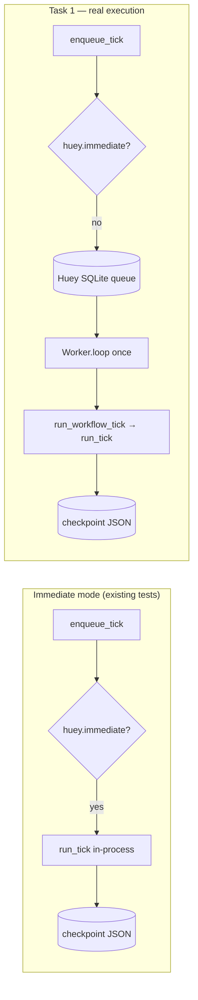

## Goal

Implement (and test) **Task 1** from [`docs/phase2-huey-transitions-spec-and-plan.md`](../phase2-huey-transitions-spec-and-plan.md):

> Prove real Huey execution (not immediate mode): enqueue a tick into Huey’s SQLite queue and assert a consumer/worker advances the checkpoint.

This is intentionally a **minimal tracer-bullet** proving that Huey can be the durable executor for the hybrid runner, without expanding scope into async-bridging or gate protocol work yet.

## Non-goals

- Changing retry semantics or replacing the immediate-mode bypass for existing tests.
- Proving multi-worker concurrency, process-mode workers, or production tuning.
- Task 2+ from the Phase 2 follow-up list (blessed async bridging, `WorkflowGate`, schema hardening).

## Current state in repo

- Spike module: [`hatpin/workflow_spikes/huey_transitions.py`](../../hatpin/workflow_spikes/huey_transitions.py)
  - `enqueue_tick()` uses `_get_huey()` (module-private) and registers `run_workflow_tick`.
  - When `huey.immediate` is true, `enqueue_tick()` calls `run_tick()` directly (with a small retry loop for simulated `OSError`), instead of exercising dequeue/execute.
- Tests: [`tests/hatpin/test_spike_huey_transitions.py`](../../tests/hatpin/test_spike_huey_transitions.py)
  - Covers `enqueue_tick()` only with `huey.immediate = True`.

## Spike API extension (tests + integration wiring)

**Decision:** expose a **small public accessor** (choice **B**), rather than importing `_get_huey()` from tests.

- **Name:** `get_spike_huey()`
- **Contract:** returns the same `SqliteHuey` instance used by `enqueue_tick()` for the current `HATPIN_SPIKE_STATE_DIR` / checkpoint layout (delegates to existing `_get_huey()`).
- **Audience:** spike modules and tests only; docstring marks it as **spike-scoped**, not a stable Hatpin workflow API.

This keeps tests readable and avoids normalizing imports of private symbols.

## Execution flow (reference)

## Prior art from Huey (what to emulate)

Huey supports running a consumer programmatically via `Huey.create_consumer(...)`, documented as an advanced testing scenario.

- API docs (Huey 3.x): [Huey.create_consumer](https://huey.readthedocs.io/en/stable/api.html#Huey.create_consumer)
- Upstream patterns:
  - **Approach A-style** (background consumer): [`huey/tests/base.py`](https://raw.githubusercontent.com/coleifer/huey/master/huey/tests/base.py) (`consumer_context`, `consumer.start()` / `stop()`).
  - **Approach A-style** (storage integration): [`huey/tests/test_storage.py`](https://raw.githubusercontent.com/coleifer/huey/master/huey/tests/test_storage.py) (`test_consumer_integration`, `Result.get(...)`).
  - **Approach B-style** (deterministic worker): [`huey/tests/test_consumer.py`](https://raw.githubusercontent.com/coleifer/huey/master/huey/tests/test_consumer.py) — exercise `Worker.loop()` directly instead of relying on immediate mode.

**Important (Huey 3):** `Consumer.loop()` is the **supervisor** loop (stop flags, health checks), not “run one task.” For a single deterministic dequeue/execute, call `Worker.loop()` on the worker implementation Huey constructs internally.

## Design options for the Task 1 test

### Approach B (primary): deterministic `Worker.loop()`

**What it is**

- Use `SqliteHuey` with **`immediate = False`** (verified via `get_spike_huey()`).
- `create_run(run_id)` then `enqueue_tick(run_id)` so the task is persisted in SQLite.
- `consumer = huey.create_consumer(workers=1, periodic=False)` — do **not** call `consumer.start()`.
- Obtain the worker implementation: `worker = consumer.worker_threads[0][0]` (the `Worker` instance paired with the not-started thread handle).
- Call `worker.initialize()` once (matches the path `Consumer` uses before the worker loop), then **`worker.loop()` once**.
- Assert checkpoint JSON advances `planning` → `coding`.

**Why this is the default**

- Exercises **enqueue → storage → dequeue → execute decorated task** without background threads.
- Aligns with Huey’s own separation: `Worker.loop()` pulls via `huey.dequeue()` and runs `huey.execute(task)`.
- Fast and stable in pytest.

**Guardrails**

- After `enqueue_tick(run_id)` returns, the checkpoint must still show **`state_id == "planning"`** (proves `enqueue_tick` did not use the immediate-mode shortcut).
- Optionally assert the Huey queue had work pending (if the project uses a supported introspection API on the installed Huey version); the checkpoint guardrail is required either way.

### Approach A (fallback): threaded consumer

**What it is**

- `consumer.start()`, enqueue, wait until checkpoint advances (polling with timeout) or `Result.get(blocking=True, timeout=...)`, then `consumer.stop(graceful=True)`.

**When to use**

- If Approach B fails in CI (unexpected storage behavior, environment constraints) while Approach A passes — document the finding in [`docs/phase2-huey-transitions-findings.md`](../../phase2-huey-transitions-findings.md) and keep the test that reflects reliable behavior.

## Concrete test contract (Task 1)

Add **one** integration-style test in [`tests/hatpin/test_spike_huey_transitions.py`](../../tests/hatpin/test_spike_huey_transitions.py):

1. `monkeypatch.setenv("HATPIN_SPIKE_STATE_DIR", str(tmp_path))`.
2. `create_run(run_id)` with a fresh `run_id`.
3. `huey = get_spike_huey(); huey.immediate = False`.
4. `enqueue_tick(run_id)`; assert checkpoint still `planning`.
5. Build `consumer = huey.create_consumer(workers=1, periodic=False)`, then run **`worker.initialize()`; `worker.loop()`** once using `consumer.worker_threads[0][0]`.
6. Assert checkpoint `state_id == "coding"` and context reflects the planning stage summary as in existing tick tests.

## Implementation sequencing

1. Add `get_spike_huey()` to the spike module (delegate to `_get_huey()`).
2. Add the single new test following Approach B.
3. Run the dev test suite (`uv run --extra dev pytest …`) and fix any Huey API mismatches by adjusting the test only unless a one-line spike fix is unavoidable.

## Next step after this spec

Once this document is reviewed and approved, use **writing-plans** to produce the implementation plan, then implement Task 1 in code.
